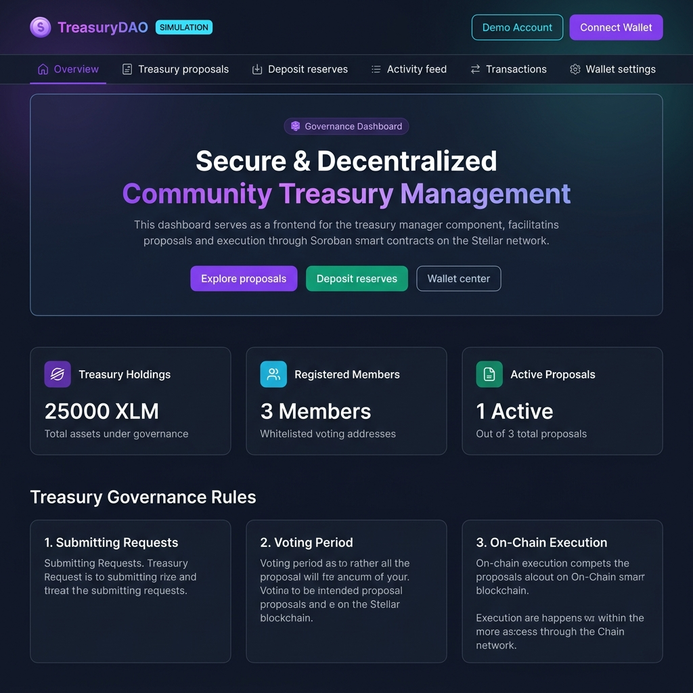
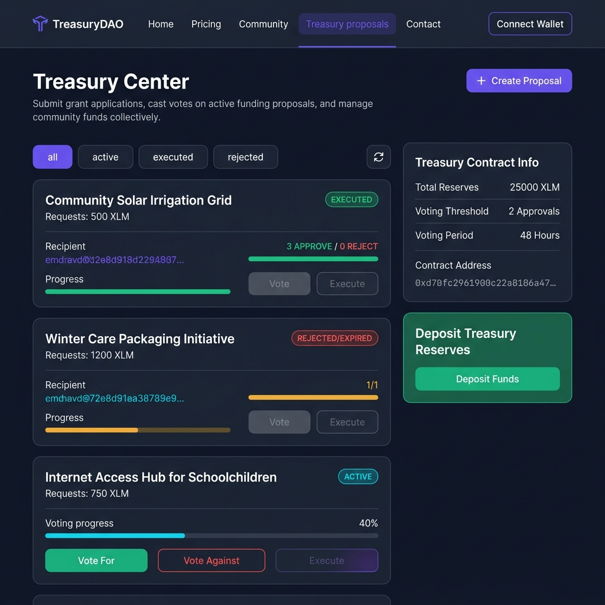
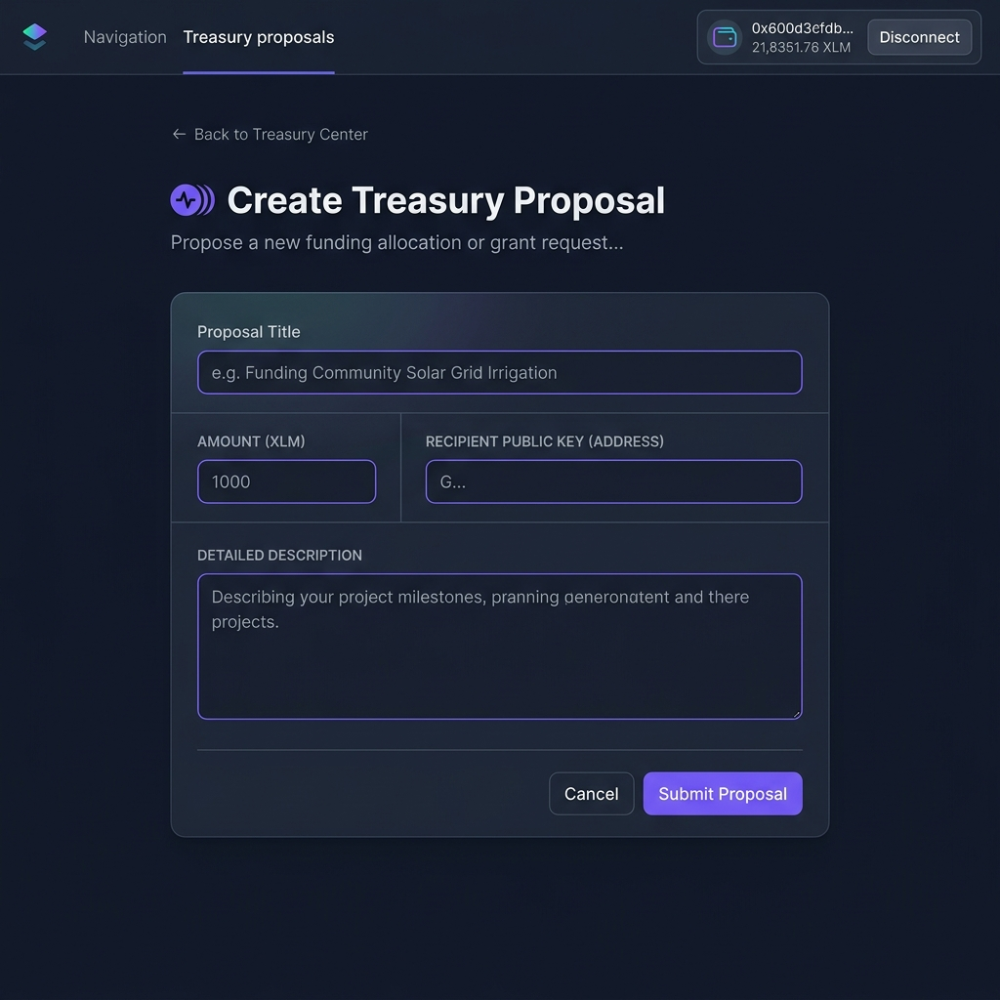
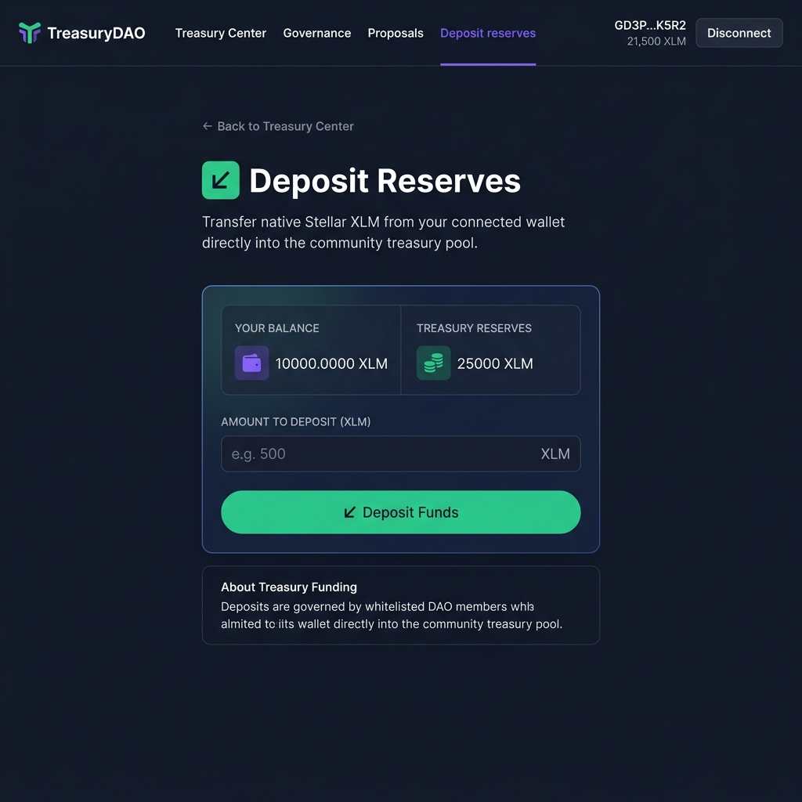
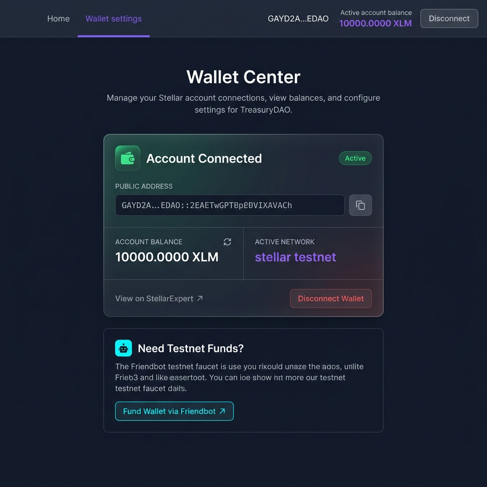
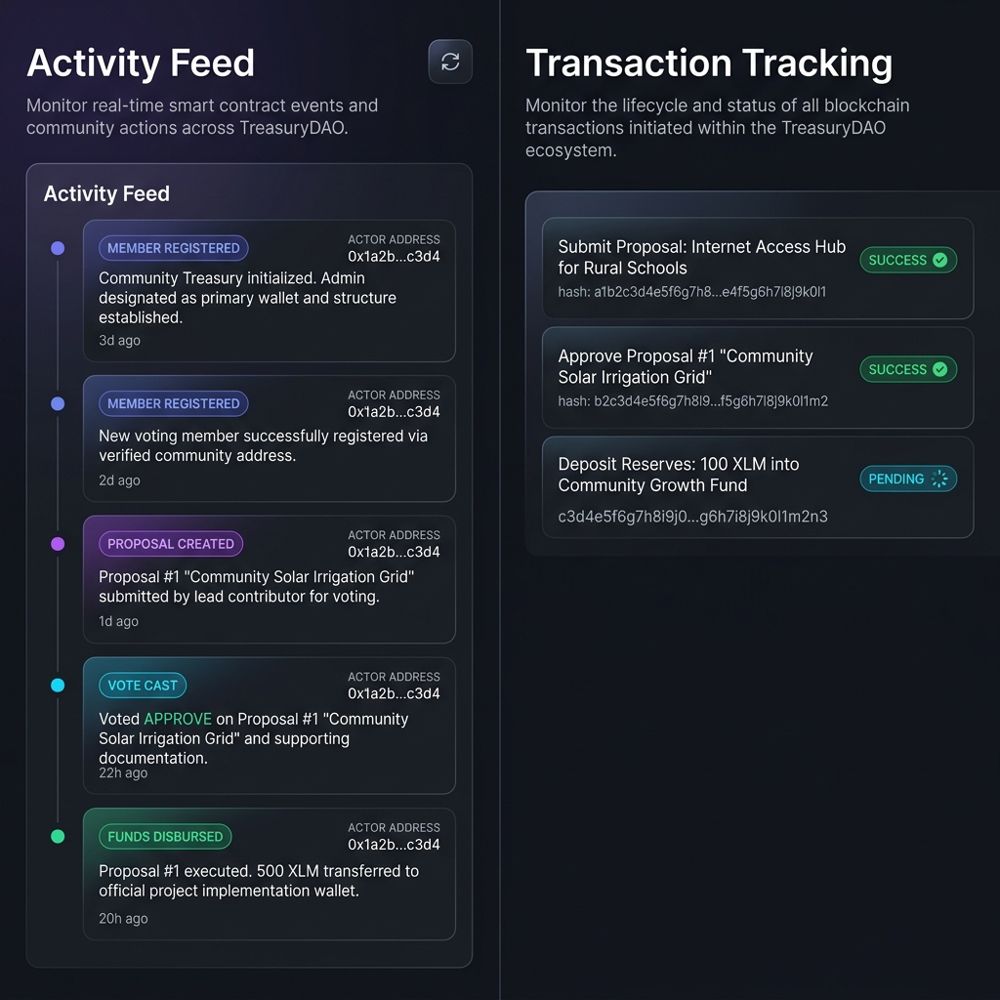

# Stellar Community Treasury Management (TreasuryDAO)

> **TreasuryDAO** is a decentralized community treasury governance DApp powered by **Soroban Smart Contracts**, **Next.js 15**, and **StellarWalletsKit** — enabling communities to collectively govern and manage a shared XLM treasury pool on the Stellar network.

---

## 📸 Screenshots

### 1. Governance Dashboard
The main overview page displays the current treasury holdings, registered member count, active proposal stats, and the governance ruleset. A prominent hero banner allows one-click navigation to key actions.



---

### 2. Treasury Proposals Center
The proposals page lists all governance funding requests with real-time vote tallies, progress bars, and status badges (Active, Executed, Rejected). Members can filter by status, vote on open proposals, or execute approved ones.



---

### 3. Create Proposal Form
Whitelisted community members can submit new disbursement proposals by specifying a title, XLM amount, recipient public key, and a detailed description. Non-members receive an access-denied screen.



---

### 4. Deposit Reserves
Any wallet holder can fund the shared treasury pool. The deposit page displays the connected wallet balance and current treasury reserves side-by-side, with an XLM amount input and balance validation guard.



---

### 5. Wallet Center
A dedicated wallet management page showing the connected Stellar public key, account balance, and active network. Supports copying the address, viewing the account on StellarExpert, refreshing balance, and one-click Friendbot faucet funding on Testnet.



---

### 6. Activity Feed & Transaction Tracking
The activity feed displays a chronological timeline of on-chain contract events (proposals created, votes cast, funds disbursed, members registered). The transactions page tracks all session-submitted transactions with live status indicators (Pending, Success, Failed) and explorer links.



---

## 🔗 Project Links

| Resource | URL |
|---|---|
| **Live Dev Server** | [http://localhost:3000](http://localhost:3000) |
| **GitHub** | [JISHU8911/Community-Treasury-Managaement_](https://github.com/JISHU8911/Community-Treasury-Managaement_) |
| **Contract Explorer** | [Stellar Expert Testnet](https://stellar.expert/explorer/testnet) |

---

## ⛓ Deployed Addresses (Stellar Testnet)

| Label | Address |
|---|---|
| **Treasury Contract ID** | `CAKUPGOZ6BVABTEFRZ2NPGZ2Z7I4ECHDS7PSJVDLGEQSSJCRPUSO6H5D` |
| **Native Token (Wrapped XLM SAC)** | `CDLZFC3SYJYDZT7K67VZ75HPJVIEUVNIXF47ZG2FB2RMQQVU2HHGCYSC` |
| **Admin / Deployer** | `GBW553N3D5WDCEX7YVVSXEH35SNKILB2SA4XV63JGJKFSMSO3ZQGT2V5` |

> Configured via `.env.local` as `NEXT_PUBLIC_TREASURY_CONTRACT_ID` and `NEXT_PUBLIC_TOKEN_CONTRACT_ID`.

---

## ✨ Key Features

- **Multi-Wallet Integration** — Connect via Freighter, Albedo, xBull, or Lobstr through `@creit.tech/stellar-wallets-kit`. Includes live connection state, balance polling, disconnect, and network detection.
- **Soroban Governance Contract** — Custom Rust contract managing whitelisted membership, proposal creation, member voting (Approve/Reject), threshold-based execution, and native XLM disbursement.
- **Dual-Driver Simulation Mode** — Run 100% offline with `NEXT_PUBLIC_MOCK_BLOCKCHAIN=true`. All proposal lifecycles, vote casting, fund execution, and event emissions are faithfully simulated in `localStorage` — no Rust or testnet tokens required.
- **Visual Transaction Tracking** — Every contract interaction is tracked in real-time with status (Pending → Success/Failed), a truncated hash, and optional StellarExpert deep links.
- **Live Activity Feed** — Chronological stream of contract events (`proposal_created`, `vote_cast`, `proposal_executed`, `deposit_received`, `member_added`) with relative timestamps and actor addresses.
- **Stellar Friendbot Integration** — One-click faucet link within the Wallet Center to fund testnet addresses with 10,000 XLM.
- **Member Access Guards** — Non-whitelisted addresses see read-only views. Creating proposals or voting requires admin-registered whitelist status.

---

## 🗂 Directory Structure

```
├── contracts/                      # Soroban Rust contract workspace
│   └── contracts/treasury/
│       ├── src/
│       │   ├── lib.rs              # Core Treasury Governance Smart Contract
│       │   └── test.rs             # Contract unit tests
│       └── Cargo.toml
├── scripts/
│   └── deploy.js                   # Node.js compile & deploy helper for Testnet
├── src/
│   ├── app/                        # Next.js 15 App Router
│   │   ├── page.tsx                # / — Governance Dashboard (hero, stats, rules)
│   │   ├── treasury/
│   │   │   ├── page.tsx            # /treasury — Proposal list, filters, contract info
│   │   │   └── create/page.tsx     # /treasury/create — Create proposal form
│   │   ├── deposit/page.tsx        # /deposit — Fund treasury reserves
│   │   ├── wallet/page.tsx         # /wallet — Wallet management & Friendbot
│   │   ├── activity/page.tsx       # /activity — Live event feed
│   │   ├── transactions/page.tsx   # /transactions — Session transaction log
│   │   ├── layout.tsx              # Root layout with Navbar & Providers
│   │   └── globals.css             # Design system (glass panels, animations, scrollbar)
│   ├── components/
│   │   ├── Navbar.tsx              # Sticky responsive header with wallet controls
│   │   ├── ProposalCard.tsx        # Voting card with progress bar & action buttons
│   │   ├── ProposalModal.tsx       # (Legacy) Proposal submission dialog
│   │   ├── providers.tsx           # Zustand + React Query wrapper
│   │   └── ui/Toast.tsx            # Toast notification system
│   ├── hooks/
│   │   ├── use-stellar-wallet.ts   # Wallet connection, balance, StellarWalletsKit bridge
│   │   └── use-treasury.ts         # React Query hooks for proposals, balance, metadata
│   ├── lib/
│   │   ├── stellar-client.ts       # StellarWalletsKit init & RPC config
│   │   ├── soroban-client.ts       # Dual mock/live RPC: contract reads & writes
│   │   └── store.ts                # Zustand global store (wallet, transactions, events)
│   └── types/treasury.ts           # TypeScript interfaces (Proposal, TreasuryEvent)
├── public/
│   └── screenshots/                # README screenshots
├── .env.local                      # Environment configuration
├── package.json
└── tsconfig.json
```

---

## 🛠 Tech Stack

| Layer | Technology |
|---|---|
| **Frontend Framework** | Next.js 15.5 (App Router, React 19) |
| **Language** | TypeScript 5 |
| **Styling** | Tailwind CSS v4 with custom glassmorphic design system |
| **Blockchain SDK** | `@stellar/stellar-sdk` v14 |
| **Wallet Integration** | `@creit.tech/stellar-wallets-kit` v1.1 (Freighter, Albedo, xBull, Lobstr) |
| **State Management** | Zustand v4 |
| **Data Fetching** | TanStack React Query v5 |
| **Icons** | Lucide React |
| **Smart Contract** | Rust · Soroban (Stellar) |

---

## 🚀 Getting Started

### Prerequisites

- **Node.js** `v20.16.0` or higher
- **NPM** `v10.8.1` or higher

### 1. Clone & Install

```bash
git clone <repository_url> community-treasury
cd community-treasury
npm install --legacy-peer-deps
```

### 2. Configure Environment

Create a `.env.local` file in the project root:

```env
# Toggle: "true" = offline simulation, "false" = live Testnet contract
NEXT_PUBLIC_MOCK_BLOCKCHAIN="true"

# Contract ID on Stellar Testnet (used when simulation is false)
NEXT_PUBLIC_CONTRACT_ID="CAKUPGOZ6BVABTEFRZ2NPGZ2Z7I4ECHDS7PSJVDLGEQSSJCRPUSO6H5D"

# Token contract (Wrapped XLM SAC)
NEXT_PUBLIC_TOKEN_CONTRACT_ID="CDLZFC3SYJYDZT7K67VZ75HPJVIEUVNIXF47ZG2FB2RMQQVU2HHGCYSC"

# Soroban RPC & network passphrase
PUBLIC_STELLAR_RPC_URL="https://soroban-testnet.stellar.org"
PUBLIC_STELLAR_NETWORK_PASSPHRASE="Test SDF Network ; September 2015"

# Admin private key for deploy script (keep secret, never commit)
STELLAR_SECRET_KEY="S..."
```

### 3. Run Development Server

```bash
npm run dev
```

Open [http://localhost:3000](http://localhost:3000) in your browser.

---

## 🔑 Authentication Architecture

TreasuryDAO uses Stellar Public Keys as the unique session identifier. No traditional credentials are required.

```
     CONNECT WALLET              SESSION STORE               ACCESS LEVEL
┌────────────────────────┐  ┌───────────────────┐   ┌───────────────────────┐
│  StellarWalletsKit     │─►│  Zustand store    │──►│  Extension Wallet     │
│  (Freighter/Albedo/    │  │  localStorage sync│   │  FULL WRITE ACCESS    │
│   xBull/Lobstr)        │  │                   │   │  (signs transactions) │
└────────────────────────┘  └───────────────────┘   └───────────────────────┘
                                                               │
                                                               ▼
                                                   ┌───────────────────────┐
                                                   │  Simulation Mode      │
                                                   │  FULL WRITE ACCESS    │
                                                   │  (mock localStorage)  │
                                                   └───────────────────────┘
```

- **Freighter / Albedo / xBull / Lobstr**: Full write access — all contract calls sign through the wallet extension.
- **Demo Account (Simulation Mode)**: A pre-seeded demo wallet with auto-whitelisted membership for instant testing.
- **Whitelist Guard**: Non-whitelisted addresses can deposit funds and view proposals, but cannot create proposals or cast votes.

---

## 📜 Soroban Smart Contract

**File**: `contracts/contracts/treasury/src/lib.rs`

### Storage Keys

```rust
pub enum DataKey {
    Admin,                    // Contract administrator address
    VoteThresholdPct,         // Required approval threshold (e.g. 50 = 50%)
    ProposalCount,            // Total number of proposals
    Proposals(u32),           // Proposal mapped by ID
    Members,                  // Vec<Address> of whitelisted members
    HasVoted(u32, Address),   // Temporary: per-proposal vote deduplication
    TokenAddress,             // SAC token used for disbursements
}
```

### Proposal Structure

```rust
pub struct Proposal {
    pub id: u32,
    pub proposer: Address,        // Submitting member
    pub receiver: Address,        // Fund recipient
    pub amount: i128,             // Amount in stroops (1 XLM = 10_000_000 stroops)
    pub description: String,
    pub votes_for: u32,
    pub votes_against: u32,
    pub status: ProposalStatus,   // Pending | Approved | Executed | Rejected
    pub deadline: u32,            // Ledger sequence number cutoff
}
```

### Contract Functions

| Function | Description |
|---|---|
| `init(admin, token, threshold_pct)` | Initializes contract, sets admin and threshold. Registers admin as first member. Panics if already initialized. |
| `add_member(admin, member)` | Admin adds a whitelisted voting member. Requires admin auth. |
| `remove_member(admin, member)` | Admin removes a member (cannot remove self). Requires admin auth. |
| `create_proposal(proposer, receiver, amount, description, deadline_ledgers)` | Registered member submits a fund disbursement proposal. Returns proposal ID. |
| `vote(voter, proposal_id, approve)` | Registered member votes For/Against an active proposal. One vote per member per proposal. |
| `execute_proposal(executor, proposal_id)` | Executes approved proposal if threshold met — transfers XLM to receiver. Marks as Rejected if deadline passed without reaching threshold. |
| `deposit(from, amount)` | Transfers XLM tokens from user wallet into treasury contract. Emits `deposit_received` event. |

---

## 🏛 Governance Lifecycle

```
    AUTHENTICATE          DEPOSIT FUNDS         CREATE PROPOSAL
┌──────────────────┐  ┌──────────────────┐  ┌──────────────────┐
│ Connect wallet   │─►│ Deposit XLM into │─►│ Whitelisted      │
│ or Demo Account  │  │ contract pool    │  │ member submits   │
└──────────────────┘  └──────────────────┘  └──────────────────┘
                                                      │
                                                      ▼
    EXECUTE FUNDS         CAST VOTES           GET CONSENSUS
┌──────────────────┐  ┌──────────────────┐  ┌──────────────────┐
│ Transfer XLM to  │◄─│ Members vote For │◄─│ Await threshold  │
│ recipient wallet │  │ or Against       │  │ (e.g. 2 votes)   │
└──────────────────┘  └──────────────────┘  └──────────────────┘
```

1. **Wallet Authentication** — Connect via any StellarWalletsKit-supported wallet or use the Demo Account for instant simulation.
2. **Deposit Reserves** — Open `/deposit`, enter an XLM amount, and sign. Funds flow into the contract treasury pool.
3. **Create Proposal** — Whitelisted members open `/treasury/create`, fill in title, recipient address, amount, and description.
4. **Voting Period** — Open proposals show For/Against buttons. Members cast one vote per proposal. Real-time tally shown on progress bar.
5. **Execution** — Once the approval threshold is reached, any member can click Execute. The contract transfers the approved XLM to the recipient.

---

## 🧪 Smart Contract Development

### Prerequisites

- **Rust & Cargo** (latest stable)
- **wasm32v1-none** compilation target
- **Stellar CLI** for deployment

### Compile & Test

```bash
# Navigate to contract directory
cd contracts/contracts/treasury

# Run unit tests
cargo test

# Build WASM binary (use wasm32v1-none for Soroban)
cargo build --target wasm32v1-none --release
```

The compiled WASM output will be at:
`contracts/target/wasm32v1-none/release/treasury.wasm`

### Deploy to Testnet

```bash
# From project root — runs upload, instantiation, and init
node scripts/deploy.js
```

The deploy script will:
1. Upload the WASM binary to the Stellar Testnet.
2. Instantiate a new contract instance.
3. Call `init` with the deployer as admin, the configured token address, and threshold.
4. Print the new Contract ID.

### Switch from Simulation to Live Testnet

Update `.env.local`:
```env
NEXT_PUBLIC_MOCK_BLOCKCHAIN="false"
NEXT_PUBLIC_CONTRACT_ID="<your_deployed_contract_id>"
```

---

## 🏗 Production Build

```bash
npm run build
npm run start
```

---

## 🌐 Design System

The app uses a consistent glassmorphic dark design system defined in `src/app/globals.css`:

| Token | Value | Usage |
|---|---|---|
| Background | `#0f172a` (Slate 900) | Page background |
| Card | `#1e293b` (Slate 800) | Panel surfaces |
| Primary | `violet-500` `#8b5cf6` | CTAs, active states |
| Secondary | `emerald-500` `#10b981` | Deposit, success |
| Accent | `cyan-500` `#06b6d4` | Info, activity |
| Danger | `red-500` | Errors, rejected |
| Warning | `amber-500` | Alerts, pending |

Key CSS utilities: `.glass-panel`, `.glass-input`, `.gradient-text`, `.glow-hover`, `.animate-shimmer`

---

## 👥 Contributors

<table>
  <tr>
    <td align="center">
      <a href="https://github.com/JISHU8911">
        <br />
        <sub><b>JISHU DAS</b></sub>
      </a><br />
      <sub>💻 Creator & Sole Developer</sub>
    </td>
  </tr>
</table>

> This project was solely designed, developed, and maintained by **JISHU DAS**.
